# FordCare

> **O histórico de manutenção pertence ao carro, não ao dono.**
> Aplicativo mobile para o Desafio 02 da Ford — Impulsionando o VIN Share na América do Sul.

---

## O problema

O **VIN Share** mede a porcentagem de veículos Ford que usam a rede oficial para manutenção. É o indicador que a Ford acompanha porque cliente retido no pós-venda compra de novo: segundo a pesquisa da NADA citada pela Ford, **83% dos clientes com boa experiência em serviços comprariam outro veículo da mesma marca** — e **80% trocam de concessionária se puderem ter melhor experiência**.

Existe um vazamento nesse funil que quase ninguém trata: **a troca de dono**. Quando um Ford é revendido, o VIN continua no parque circulante e a Ford continua contando aquele carro no denominador do indicador. Mas o histórico de manutenção morre junto com a conta do dono anterior. O comprador entra como lead frio, sem relação com nenhuma concessionária, e vai para a oficina mais barata.

O Brasil vende mais seminovo do que zero-quilômetro. Esse é o maior ralo do funil, e ele é invisível para qualquer app que guarde o histórico embaixo do usuário.

## A solução

O FordCare ancora o histórico no **chassi (VIN)**, não na conta. Isso muda três coisas:

1. **O dono atual ganha um motivo egoísta para não fugir da rede.** Carro com histórico completo e rastreável na rede oficial vale mais na revenda — cada serviço registrado é patrimônio que ele constrói.
2. **O comprador entra no app com um veículo já conhecido**, com histórico e com a próxima revisão calculada, em vez de ser um lead frio.
3. **A Ford passa a enxergar o denominador real.** O app deixa o cliente registrar também o que fez fora da rede — é esse dado que transforma VIN Share de estimativa em medida.

> O VIN Share de hoje financia o VIN Share do próximo dono.

---

## Funcionalidades

### Passaporte do Veículo
Histórico lido pelo chassi, com validação offline do VIN segundo a ISO 3779: 17 caracteres, ausência de I/O/Q, identificação do fabricante pelo WMI e decodificação do ano-modelo. O dígito verificador é conferido como **aviso**, nunca bloqueio — ele é obrigatório no mercado norte-americano, não no Brasil, e reprovar por ele rejeitaria chassis brasileiros legítimos.

A tela mostra o selo de continuidade (serviços, anos de histórico, **percentual real** na rede oficial) e uma linha do tempo que distingue visualmente o que passou pela Ford do que não passou. O passaporte pode ser compartilhado com o comprador na hora da venda.

### Copiloto
Recomendação priorizada na Home, em três camadas:

- **Sinais** — km/mês estimado a partir do histórico, idade do veículo, alertas vencidos e a vencer, tempo desde o último serviço na rede.
- **Priorização** — heurística explicável, sem caixa-preta, que ordena o que resolver primeiro.
- **Texto** — a frase mostra o *porquê* com números reais: *"Está vencida há 1.200 km. Você roda cerca de 850 km por mês."*

O CTA abre o agendamento com os serviços já pré-selecionados. Os números nunca saem de um modelo generativo — vêm da camada de sinais.

### Lembretes proativos
O app agenda notificação local para o alerta que está prestes a vencer, com data calculada pelo ritmo de uso real do veículo, não por prazo fixo. É o *lead de serviço proativo* do desafio, entregue no celular do cliente sem custo de infraestrutura.

### Registro de serviço fora da rede
Fluxo em três etapas (veículo → serviços → revisão), igual ao de agendamento. Parece contraintuitivo deixar o cliente registrar o que fez na oficina do bairro — e é exatamente por isso que funciona: sem esse dado, o app só enxerga o numerador. Esses registros não pontuam e entram marcados no histórico.

### Alertas por tipo de serviço
Quatro regras (óleo, revisão geral, rodízio de pneus, filtro de ar), cada uma com intervalo próprio em km e em dias. Resolver três de quatro serviços resolve só esses três. Os alertas são calculados **por veículo**, a partir do chassi.

### Programa de pontos
Serviços na rede oficial geram pontos. Níveis Bronze, Prata e Ouro derivam dos **pontos acumulados na vida toda** (`lifetime_points`), separados do saldo gasto em resgates — sem essa separação, resgatar um benefício rebaixaria o cliente de nível, o oposto do que um programa de fidelidade deve fazer.

---

## Telas

Capturas da build atual, em viewport de 390 x 844 (iPhone 14/15) com densidade 2x. As 22 telas do app estão aqui — nenhuma rota ficou de fora.

### Onboarding — a ideia antes do login

| O problema | A solução | O ganho |
|:---:|:---:|:---:|
| 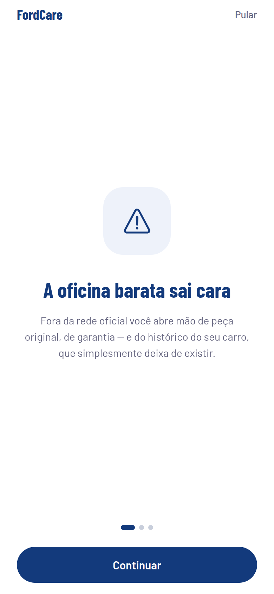 | 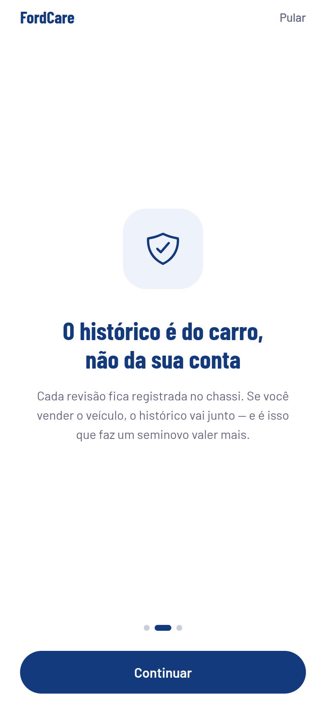 | 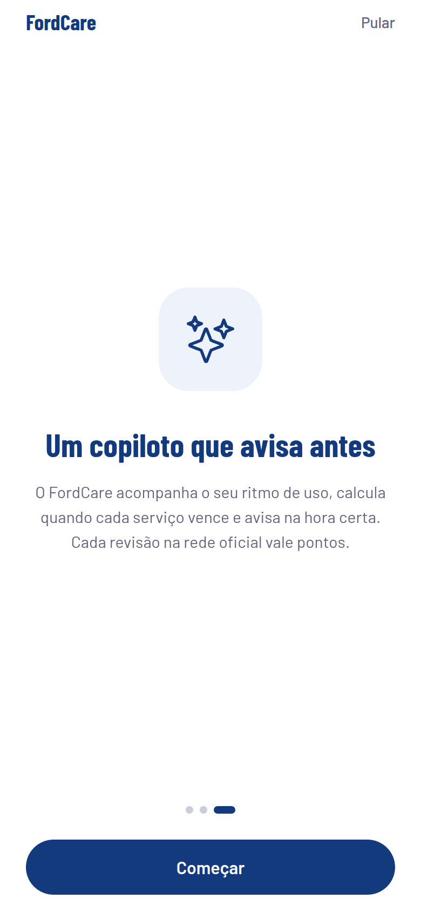 |

### Entrada na conta

| Boas-vindas | Login | Cadastro |
|:---:|:---:|:---:|
|  |  |  |

### Home e Copiloto

| Veículo e status | Recomendação priorizada |
|:---:|:---:|
| 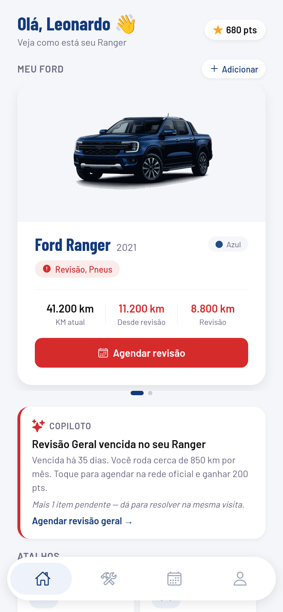 | 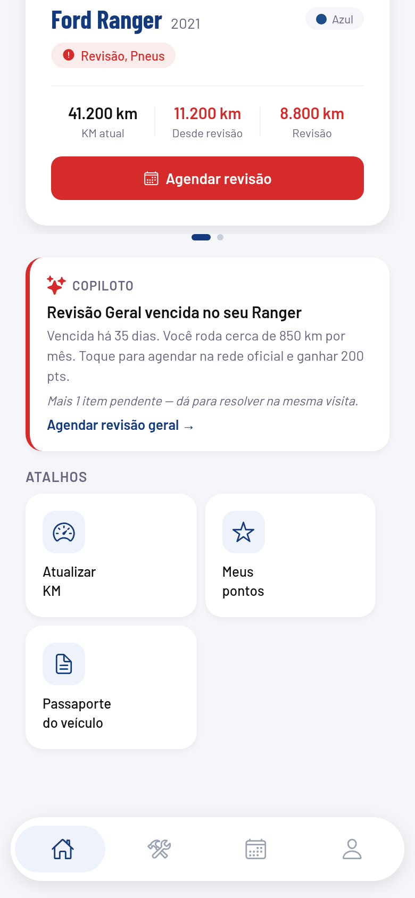 |

### Manutenção — pendências e histórico

| Pendências | Histórico com categorias e filtros |
|:---:|:---:|
| 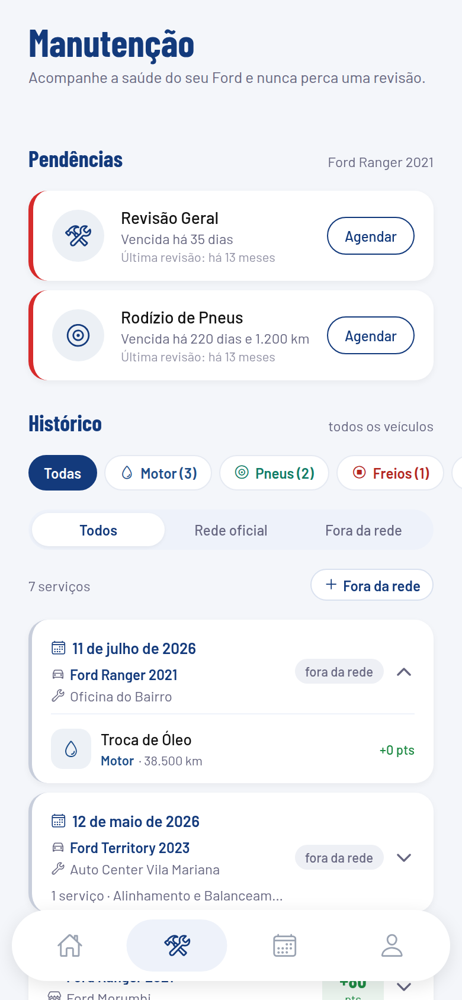 | 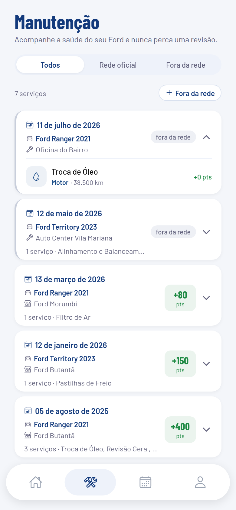 |

### Passaporte do Veículo

| Histórico ancorado no chassi |
|:---:|
| 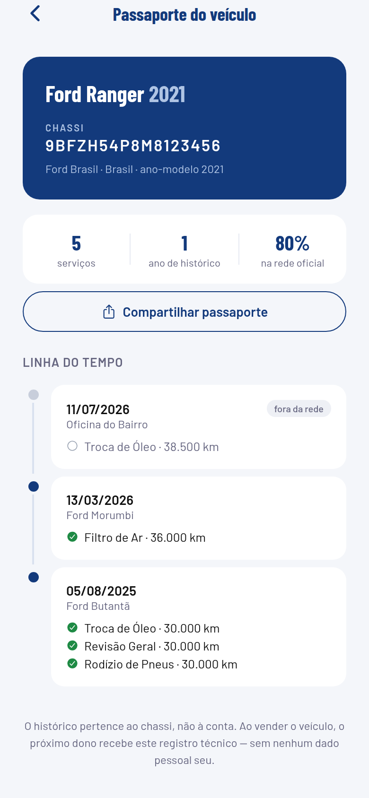 |

### Agendamento — lista e detalhe

| Meus agendamentos | Detalhe do agendamento |
|:---:|:---:|
| 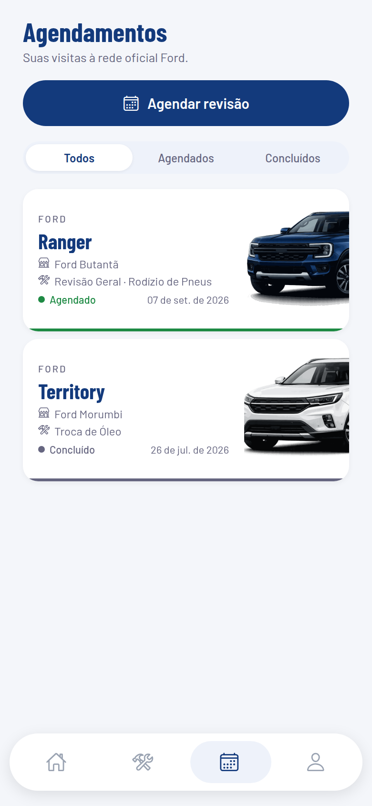 | 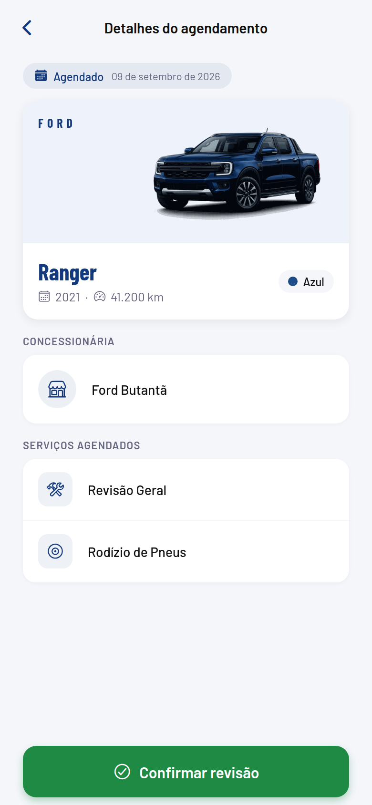 |

### Agendamento — o fluxo em três etapas

| 1 · Veículo | 2 · Serviços e concessionária | 3 · Revisão |
|:---:|:---:|:---:|
| 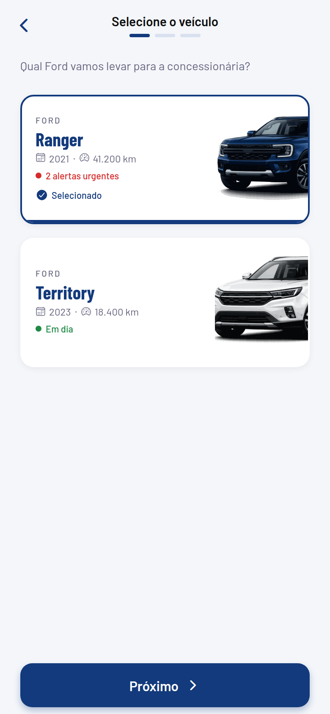 | 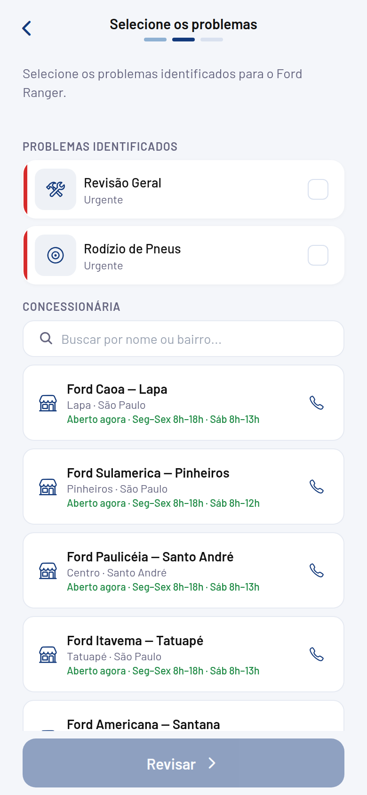 | 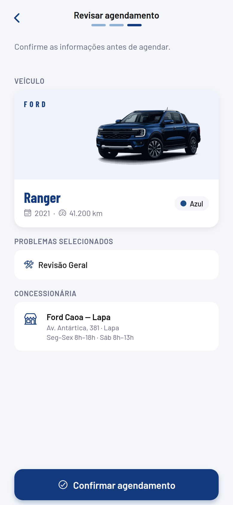 |

### Serviço fora da rede — o mesmo fluxo em três etapas

| 1 · Veículo | 2 · O que foi feito | 3 · Revisão |
|:---:|:---:|:---:|
| 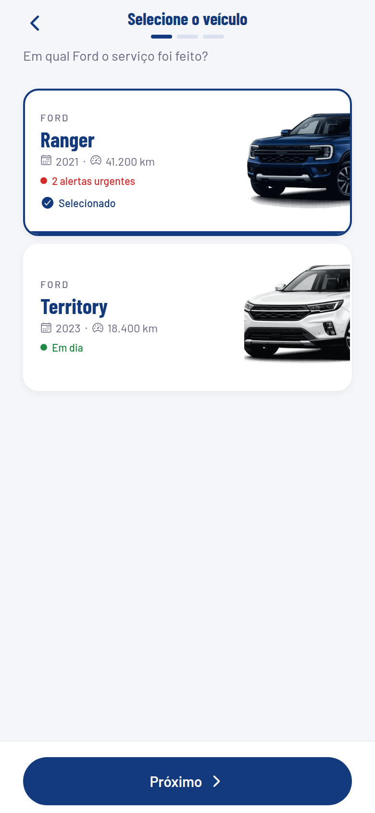 | 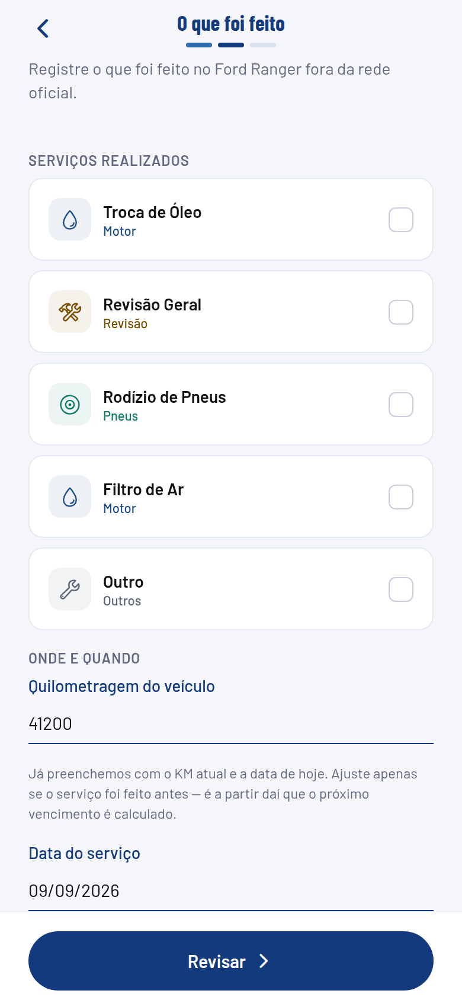 | 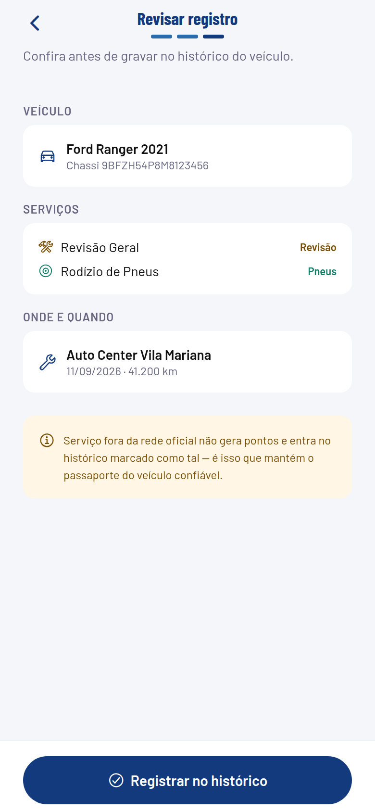 |

### Perfil e cadastro de veículo

| Pontos e impacto | Benefícios | Cadastro com VIN |
|:---:|:---:|:---:|
| 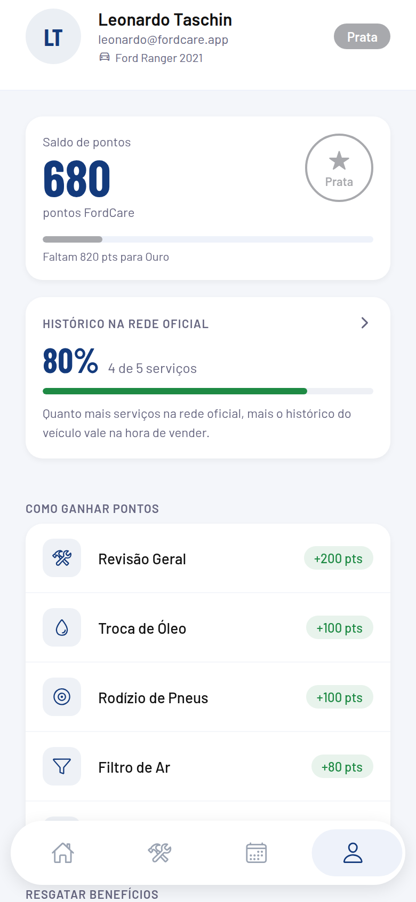 | 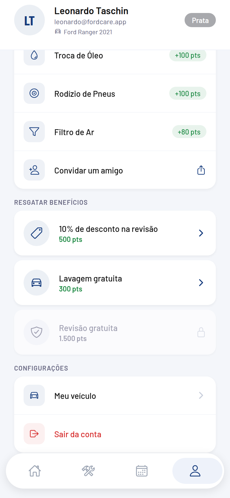 | 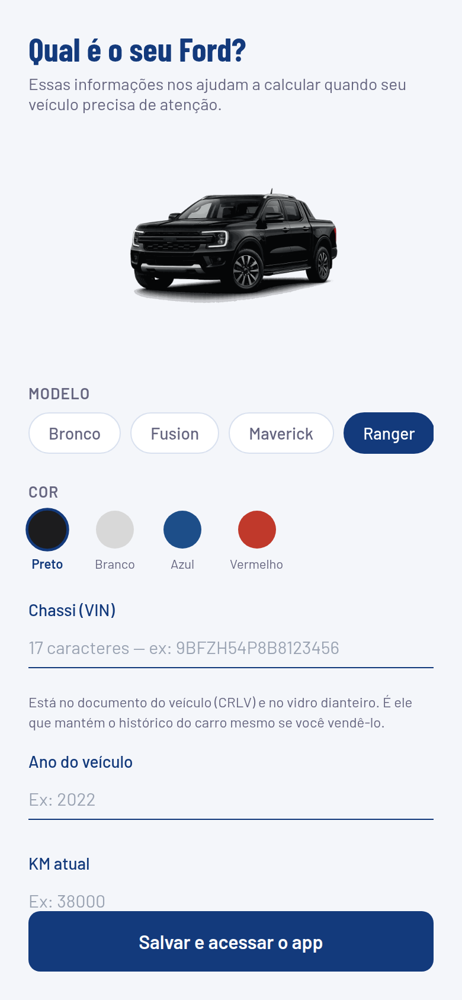 |

---

## Como rodar

```bash
npm install
cp .env.example .env      # preencha com as chaves do Supabase
npx expo start
```

No Supabase, execute uma vez o arquivo **`supabase/000_sprint3_completo.sql`** no SQL Editor. Ele reúne todas as migrações na ordem correta, é idempotente, e a última query devolve uma linha de conferência — as cinco colunas devem voltar com `1`.

### Build do APK

```bash
npx eas login
npx eas init                                  # grava o projectId no app.json
npx eas build -p android --profile preview    # APK instalável
```

O perfil `preview` do `eas.json` já está configurado para gerar `.apk` em vez de `.aab`.

⚠️ Antes de buildar, publique as variáveis de ambiente no EAS com `npx eas env:create`. O `.env` está no `.gitignore` e **não** sobe para o servidor de build — sem esse passo o APK é gerado, instala e abre, mas nenhuma chamada ao Supabase funciona.

O passo a passo completo, com o roteiro de verificação de todos os fluxos no aparelho, está em [`docs/entrega-final.md`](docs/entrega-final.md).

---

## Arquitetura

| Camada | Escolha | Por quê |
|---|---|---|
| Framework | React Native 0.74 + Expo SDK 51 | Stack da disciplina, entrega nativa Android/iOS |
| Navegação | Expo Router (file-based) | Rotas declarativas e deep links |
| Estado global | Context API + `useReducer` | Complexidade não justifica dependência externa |
| Backend | Supabase (PostgreSQL + Auth + RLS) | Row Level Security por usuário, SDK TypeScript |
| Token de sessão | `expo-secure-store` | Keychain no iOS, EncryptedSharedPreferences no Android |
| Cache local | AsyncStorage | Sessão e dados do usuário offline |
| Notificações | `expo-notifications` | Lembretes locais, sem servidor de push |
| Tipagem | TypeScript | 100% dos arquivos, `tsc --noEmit` limpo |

### Estrutura

```
app/                    telas (Expo Router)
  (tabs)/               Home, Manutenção, Agendamentos, Perfil
  agendamento/          fluxo de agendamento (novo, detalhe)
  servico/externo       registro de serviço fora da rede
  veiculo/              cadastro e passaporte
  auth/                 onboarding, login, cadastro
components/             componentes reutilizáveis
constants/              tokens de design, regras, categorias, concessionárias
contexts/               UserContext (perfil, veículos, manutenções)
hooks/                  useAlerts, useProactiveReminders
services/               Supabase: auth, vehicle, maintenance, agendamentos, benefits, auditLog
supabase/               migrações SQL
utils/                  lógica pura: vin, alerts, copiloto, formatação
__tests__/              suíte Jest das funções puras
docs/                   backlog, roteiro de entrega e Cybersecurity
```

### Decisões que valem explicação

**Lógica de negócio fora do React.** `utils/vin.ts`, `utils/alerts.ts` e `utils/copiloto.ts` não importam React nem React Native. São funções puras e determinísticas, e por isso testáveis sem mock, sem renderizar componente e sem rede.

**O histórico é do chassi.** `maintenances` carrega `vin`, e os alertas de um veículo são calculados só com o histórico dele. Ao ordenar o último serviço de cada tipo, o desempate é pelo maior KM — o odômetro só anda para frente, então dois serviços do mesmo dia se resolvem pela quilometragem.

**Erros sanitizados para o usuário, brutos para o desenvolvedor.** `utils/safeError.ts` traduz falhas em mensagens seguras (nunca expõe tabela, política RLS ou stack) e o `logDevError` imprime o erro real apenas em `__DEV__`.

**Nenhuma chamada de rede sem limite.** Operações de escrita têm timeout, para que uma promessa pendurada vire erro visível em vez de botão girando para sempre.

**Tokens de design, não hex soltos.** Toda cor sai de `constants/theme.ts`.

---

## Testes

Jest com o preset `jest-expo`. Toda a lógica de negócio vive em funções puras, então
a suíte roda sem mock, sem renderizar componente e sem rede.

```bash
npm test              # 101 testes
npm run test:coverage # relatório de cobertura
npm run typecheck     # tsc --noEmit
```

| Arquivo | Cobre |
|---|---|
| `__tests__/vin.test.ts` | dígito verificador contra VIN de referência público, ano-modelo no ciclo de 30 anos, letras proibidas (I, O, Q), WMI desconhecido, mascaramento |
| `__tests__/alerts.test.ts` | escopo do histórico por veículo, desempate por quilometragem no mesmo dia, serviço fora da rede zerando o alerta, frases de vencimento |
| `__tests__/copiloto.test.ts` | estimativa de km/mês com limites de sanidade, priorização e teto de duas recomendações |
| `__tests__/serviceCategories.test.ts` | classificação por tipo e por palavra-chave em texto livre, insensível a acento e caixa |
| `__tests__/safeError.test.ts` | garantia de que nome de tabela, política RLS e stack trace nunca chegam à interface |
| `__tests__/formatters.test.ts` | formatação pt-BR de km e datas, cálculo de dias decorridos e restantes |

Vários testes nasceram de bugs reais encontrados em uso — o desempate por
quilometragem e a ordenação do `ERROR_MAP` são dois deles.

---

## Segurança e LGPD

- Token de sessão em armazenamento criptografado (`expo-secure-store`)
- Row Level Security por `user_id` em todas as tabelas
- Resgate de benefício em função SQL com `FOR UPDATE`, evitando saldo negativo por corrida entre dispositivos
- Trilha de auditoria com política de escrita apenas (o usuário nunca lê nem edita os próprios logs)
- Mensagens de erro sanitizadas antes de chegar à interface
- Permissão de localização usada de fato (ordenação de concessionárias por distância) e opcional — negá-la não quebra nenhum fluxo

Detalhamento em `docs/entrega-cybersecurity.md`.

---

## Escopo desta entrega

O ponto de partida foi o feedback da Ford sobre a V1. Cada crítica virou uma entrega verificável:

| Feedback da Ford | O que foi feito |
|---|---|
| *"Contar melhor a ideia do app"* | Onboarding de três telas antes do login, que apresenta o problema, a solução e o ganho — e um README que abre pelo problema de negócio, não pela lista de features |
| *"Histórico de revisão após troca de dono de veículo"* | Passaporte do Veículo: o histórico é lido pelo chassi, não pela conta, e sobrevive à revenda |
| *"Sugestão personalizada com uma IA que checa o status do veículo"* | Copiloto: camada de sinais determinística que estima ritmo de uso, prioriza o que venceu e justifica a recomendação com números reais |

**Deliberadamente fora do escopo.** A transferência ativa de propriedade — dono gera um código, comprador herda o histórico — ficou para a Sprint 4. O Passaporte já demonstra a tese central, e preferimos entregar menos coisas funcionando por inteiro a mais coisas pela metade. É a mesma razão pela qual o Copiloto não chama modelo generativo: os números que aparecem na tela precisam ser auditáveis.

**Conhecido e assumido.** Os pontos e os benefícios usam um catálogo fixo em `constants/`; num cenário real viriam da Ford. As concessionárias são uma base estática de unidades reais de São Paulo, com coordenadas — suficiente para a ordenação por distância funcionar de verdade, insuficiente para cobrir o país.

---

## Equipe

| Nome | RM |
|---|---|
| Gustavo Alves | 557876 |
| Gabriel Dias | 556830 |
| Gabriel Galerani | 557421 |
| Pedro Paulo | 554880 |
| Leonardo Taschin | 554583 |

Projeto da disciplina **Mobile Development and IoT** — 3º ano de Engenharia de Software, FIAP, em parceria com a **Ford Brasil**. Backlog da sprint em `docs/sprint3-backlog.md`.
